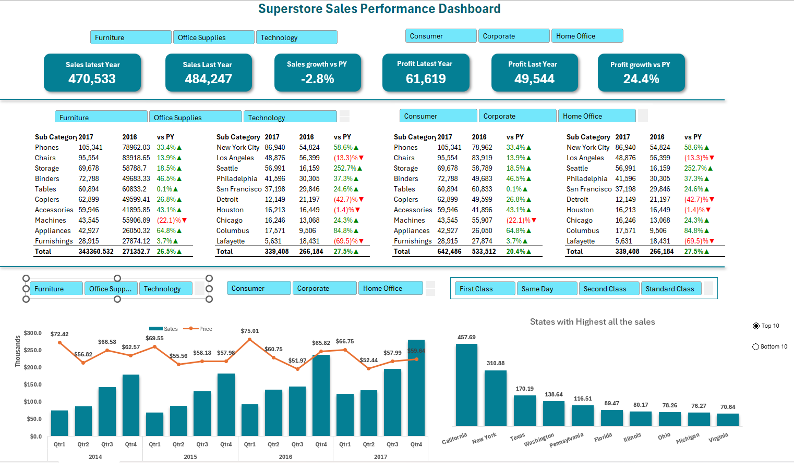

# Superstore Sales Dashboard (Excel Project)

## About the Project
I worked on this project to analyze retail sales data and understand how different products, regions, and time periods are performing.

The goal was to turn raw data into a simple, interactive dashboard that shows clear business insights.

---

## Files Included
- Superstore_Dashboard.png
- superstore_sales_dashboard.xlsx   

---

## What I Did
- Cleaned the data (removed duplicates, fixed formats, handled missing values)  
- Created pivot tables to summarize sales and profit  
- Built an interactive dashboard using slicers and charts  
- Analyzed trends across products, regions, and time  

---

## Key Observations
- Phones and Chairs generate the highest sales  
- Copiers give the highest profit  
- Tables and Bookcases are running at a loss  
- Sales are highest in 2017 compared to previous years  
- November and December have the highest sales (seasonal trend)  
- California and New York are the top-performing states  

---

## What I Learned
- How to clean and prepare messy data  
- How to use pivot tables for analysis  
- How to build dashboards in Excel  
- How to explain data in a simple business way  

---

## Improvements I Would Suggest
- Focus more on high-profit products like Copiers  
- Review pricing or cost for loss-making products  
- Increase marketing during year-end (peak sales period)  
- Expand business in top-performing regions  

---

## Tools Used
- Microsoft Excel (Pivot Tables, Charts, Slicers)

---

## Dashboard Preview

---

## Final Note
This project helped me understand how data can be used to make business decisions.  
I focused on keeping the dashboard simple and easy to understand.
