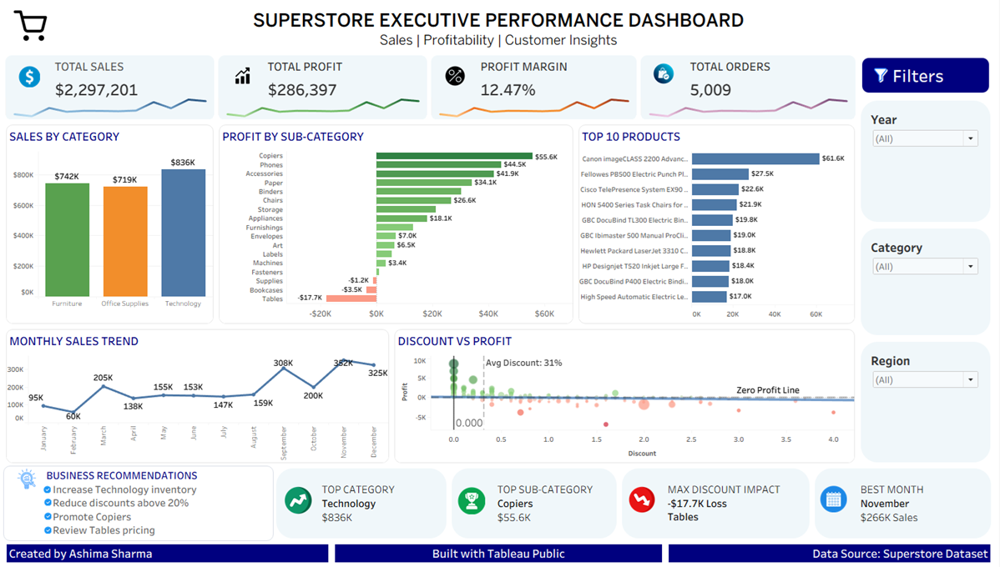

# 📊 Superstore Business Analysis


> **End-to-end retail sales analysis using SQL, Microsoft Excel, and Tableau to transform raw transactional data into actionable business insights.**

---

# 📷 Dashboard Preview

### Tableau Dashboard



---

# 📌 Project Overview

Businesses generate large volumes of transactional data every day, but raw data alone does not provide meaningful insights.

This project analyzes the **Sample Superstore** retail dataset to identify sales trends, profitability, product performance, regional performance, and the impact of discounts on profit.

The project demonstrates an end-to-end analytics workflow using **SQL** for data analysis, **Microsoft Excel** for exploratory analysis, and **Tableau** for building an interactive executive dashboard.

---

# ⭐ Why This Project?

- Demonstrates an end-to-end analytics workflow using SQL, Excel, and Tableau.
- Builds interactive dashboards for business decision-making.
- Identifies key sales and profitability trends.
- Provides actionable business recommendations.
- Demonstrates data visualization and storytelling skills.

---

# 🎯 Business Objectives

This project answers key business questions including:

- Which product categories generate the highest sales?
- Which sub-categories generate the highest profit?
- Which products consistently incur losses?
- How do discounts affect profitability?
- Which months generate the highest sales?
- Which states contribute the highest revenue?
- Which products should the business prioritize?

---

# 🛠️ Tools & Technologies

| Tool | Purpose |
|------|---------|
| SQL | Data querying and business analysis |
| Microsoft Excel | Data cleaning, Pivot Tables, Pivot Charts, Dashboard |
| Tableau | Interactive dashboard and visualization |
| GitHub | Project documentation and portfolio |

---

# 📂 Project Workflow

```text
Sample Superstore Dataset
          │
          ▼
     SQL Analysis
          │
          ▼
  Excel Dashboard
          │
          ▼
 Tableau Interactive Dashboard
          │
          ▼
 Business Insights
          │
          ▼
 Business Recommendations
```

---

# 📊 SQL Analysis

SQL was used to answer important business questions such as:

- Total Sales
- Total Profit
- Sales by Category
- Profit by Sub-Category
- Monthly Sales Trend
- Regional Performance
- Top Selling Products
- Customer Analysis

📁 **SQL File**

```text
sql/sql_analysis.sql
```

---

# 📈 Excel Dashboard

Microsoft Excel was used for exploratory data analysis before creating the Tableau dashboard.

### Features

- Data Cleaning
- Pivot Tables
- Pivot Charts
- Interactive Slicers
- Sales Trend Analysis
- Profit Analysis
- Regional Analysis

### Dashboard Preview


---

# 📊 Tableau Dashboard

The Tableau dashboard provides an executive-level overview of sales performance and profitability through interactive visualizations.

### Dashboard Features

- KPI Cards
- Sales by Category
- Profit by Sub-Category
- Monthly Sales Trend
- Top 10 Products
- Discount vs Profit Analysis
- Interactive Filters
- Business Recommendations

### Dashboard Preview


---

# 📌 Key Performance Indicators (KPIs)

- Total Sales
- Total Profit
- Total Orders
- Profit Margin
- Top Selling Category
- Most Profitable Sub-Category
- Best Performing Month
- Highest Loss-Making Sub-Category

---

# 💡 Key Business Insights

- Technology generated the highest overall sales.
- Copiers delivered the highest profit among all sub-categories.
- Tables and Bookcases consistently generated losses.
- Higher discounts generally reduced profitability.
- November recorded the highest monthly sales.
- California and New York contributed the highest sales revenue.

---

# 📌 Business Recommendations

- Increase inventory for high-performing Technology products.
- Promote high-profit products such as Copiers.
- Review pricing strategies for Tables and Bookcases.
- Reduce excessive discounting on low-margin products.
- Increase marketing campaigns before peak sales months.
- Focus expansion efforts on top-performing regions.

---

# 📈 Project Outcome

This project demonstrates my ability to:

- Analyze business data using SQL
- Perform exploratory analysis in Microsoft Excel
- Build interactive dashboards in Tableau
- Develop KPIs for business reporting
- Translate data into actionable business recommendations
- Communicate insights through effective data storytelling

---

# 🌐 Interactive Tableau Dashboard

Explore the fully interactive dashboard here:

**🔗 Tableau Public**

https://public.tableau.com/views/Superstore_Sales_Profit_Analysis_17766313435960/SuperstoreSalesProfitDashboard

---

# 📂 Dataset Overview

**Dataset:** Sample Superstore

The dataset contains transactional retail sales information including:

- Orders
- Customers
- Products
- Categories
- Sales
- Profit
- Discount
- Quantity
- Shipping
- Regions
- States

---

# 📁 Repository Structure

```text
Superstore-Business-Analysis
│
├── README.md
├── LICENSE
│
├── data
│   └── Sample_Superstore.xlsx
│
├── sql
│   └── sql_analysis.sql
│
├── excel
│   ├── Superstore_Excel_Dashboard.xlsx
│   └── Excel_Dashboard.png
│
└── tableau
    ├── Superstore_Sales_Profit_Analysis.twbx
    └── Tableau_Dashboard.png
```

---

# 🚀 Skills Demonstrated

- SQL
- Microsoft Excel
- Tableau
- Data Cleaning
- Data Analysis
- Dashboard Design
- Data Visualization
- KPI Development
- Business Intelligence
- Business Storytelling
- Analytical Thinking

---

# 👩‍💻 About Me

**Ashima Sharma**

Aspiring Data Analyst with a strong foundation in **SQL, Microsoft Excel, and Tableau**. Passionate about transforming raw data into actionable business insights through analytics, visualization, and data storytelling.

### Connect with Me

📧 **Email:** ashimasharma737@gmail.com

💼 **LinkedIn:** https://linkedin.com/in/ashimasharma73

🐙 **GitHub:** https://github.com/data-analyst-portfolio/Superstore-Business-Analysis


---
